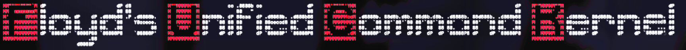

# Floyd's Unified Command Kernel



*One command surface. Every Legacy AI capability wired into it. Built in a garage because the existing options annoyed us.*

---

**DOCUMENT CLASSIFICATION:** README / Anti-Corporate
**DATE RECORDED:** 2026-05-09 — Probably Past Bedtime
**LOCATION:** The Garage, Brown County, Indiana
**BEVERAGE:** Coffee that tastes like a lawnmower's opinion
**CURRENT STATE:** Caffeinated

---

## What This Thing Is

The Kernel is not a shell. It's not a launcher. It's not a collection of iframes wearing a trench coat and pretending to be integrated.

It is **one application**. Terminals, workspace editing, agent execution, system health, infrastructure mapping, project governance — all copied in, all adapted, all owned by the Kernel. The originals stay standalone and untouched because that's how reuse actually works.

Some people think the initials mean something. Those people need to get their minds out of the gutter. It stands for Floyd's Unified Command Kernel. That's it. Nothing else. Stop snickering. Bella is judging you.

---

## What You're Looking At

- **Backend:** FastAPI (Python 3.14)
- **Frontend:** Zero-build vanilla JavaScript — no bundler, no npm install, no three-hour webpack config that breaks on Tuesdays
- **Port:** 10527
- **Tests:** 195 of them, and they all pass
- **Tabs:** 11 nav surfaces covering the full Legacy AI stack

---

## Get It Running

```bash
make venv
make run
```

Then open `http://localhost:10527/`. That's it. No Docker, no Kubernetes manifest, no YAML file written by someone who describes themselves as a "cloud evangelist."

---

## Make Sure It Works

```bash
.venv/bin/python -m pytest -v
```

195 tests should pass. A few workflow tests want Playwright browsers — run `.venv/bin/playwright install` if you care about those.

---

## The 11 Tabs

| Tab | What It Does |
|---|---|
| Project Control | Governance dashboard — scan projects, quarantine garbage, tag things |
| Terminal Console | Real PTY over WebSocket, xterm.js rendering |
| Dual Console | Two terminals, because one is never enough |
| Workspace | File browser for your filesystem |
| Workspace Editor | MWIDE-based code editor, injected directly into the DOM |
| System Health | What's broken and why |
| System Map | Infrastructure cartography in a Shadow DOM |
| Agent Execution | ATerm-powered agent terminals with PTY lifecycle |
| Dev Launcher | Launch development tools (iframe, because it's a self-contained Vite SPA) |
| Spend Watch | Track where the money goes |
| Mac Cleanup | System cleanup reports |

---

## Architecture Rules We Actually Follow

1. **The Kernel is one product.** Old app names are provenance, not product labels.
2. **Source apps get copied in, then adapted.** Not rewritten from memory like a bad book report.
3. **Original source apps stay untouched.** They're standalone products.
4. **Iframes are for self-contained SPAs only.** Everything else gets direct DOM injection.
5. **All routes, ports, and names are Kernel-native.** No legacy cruft in the URL bar.

---

## The Docs

| Document | Purpose |
|---|---|
| `control-center/SSOT/control-center_SSOT.md` | The source of truth — read this before changing anything |
| `control-center/docs/FEATURES.md` | Every feature, active and dormant, with technical detail |
| `CHANGELOG.md` | What shipped and when |
| `control-center/docs/RELEASE.md` | Release manifest |

---

## The Cats

Floyd's Labs is a garage in Brown County, Indiana. We answer to cats, not shareholders.

- **Bella** — Senior Quality Assurance. A black cat of substantial carriage who walks on keyboards and has never filed a false-positive bug report.
- **Bowser** — Technical Director. Skinny. Monitors the router. Judges your latency.

Neither of them has ever said "let's circle back on the naming convention." Neither of them knows what an acronym is. They're cats.

---

┌──────────────────────────────────────────────────────────┐
│  DOCUMENT METADATA                                        │
├──────────────────────────────────────────────────────────┤
│  Classification:   README                                  │
│  Cat Supervision:  Bella (QA) and Bowser (Networking)     │
│  Lines of Code:    11,599 Python + whole lotta TypeScript │
│  Corporate Feelings: HURT (intended)                       │
│  Acronym Meaning:   Floyd's Unified Command Kernel ONLY   │
└──────────────────────────────────────────────────────────┘
